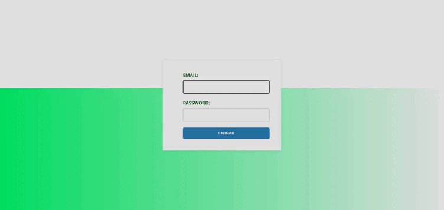

<div style="background-color: #ffA500; padding: 20px; border-radius: 10px; margin-bottom: 20px;">
  
  
  [](https://git.io/typing-svg)

  
</div>

[](https://skillicons.dev)
---

# Backend Node.js para Sistema de Login

Bem-vindo ao backend do meu sistema de login! Este projeto foi desenvolvido para agilizar o desenvolvimento de sistemas, oferecendo um gerenciamento seguro e eficaz de usuários.

## Principais Recursos

- **API RESTful:** Utiliza Express.js para fornecer uma API RESTful para interação com o frontend.
- **Segurança:** Implementa práticas seguras para garantir a proteção dos dados dos usuários.
- **Configuração Fácil:** Configure o sistema facilmente através do arquivo `.env`.
---
<div align="center">
  <p><strong>Observação:</strong> A imagem sofreu redução de qualidade devido à conversão de vídeo para GIF. 😉</p>
  
</div>

## Configuração do Banco de Dados

Aqui está um exemplo de script SQL para criar a tabela `users`:

```
CREATE TABLE users (
  id INT AUTO_INCREMENT PRIMARY KEY,
  uuid VARCHAR(255) NOT NULL,
  name VARCHAR(255) NOT NULL,
  email VARCHAR(255) NOT NULL,
  password VARCHAR(255) NOT NULL,
  timestamp TIMESTAMP DEFAULT CURRENT_TIMESTAMP
);
```

Para começar, você pode adicionar um usuário inicial à tabela. Aqui está um exemplo de script SQL para inserir um usuário:

```
INSERT INTO users (email, password, uuid, timestamp, name)
VALUES ('vitor@developer.com', MD5('Helloword'), 'ID000001', CURRENT_TIMESTAMP, 'VitorJesus');

```
